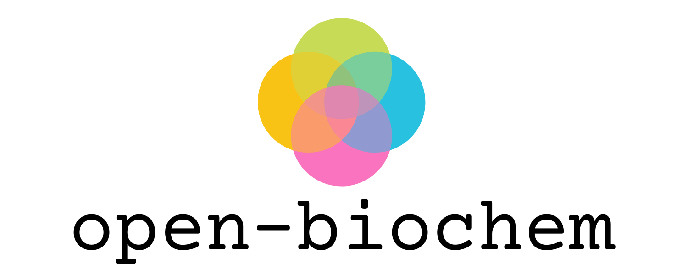

# open-biochem

<p align="center">
  
</p>

Open resources for biology, chemistry, and computation.

## How this repository is organized
```
├── assets/     # Images and other media.
├── book/       # Draft of comprehensive, open source textbook on biology, chemistry, and computation.
├── flashcards/ # Structure YAML files for things worth memorizing.
├── ideas.md    # Ideas for future projects.
├── notes/      # Notes to be converted into book sections, or blog posts.
├── papers/     # Papers to read.
├── README.md   # this document
├── reference/  # Reference sheets and other structured data.
├── todo.md     # Websites, papers, and other resources to explore.
├── tools.md    # A list of tools used in research and education.
└── usnco/      # Resources related to the United States National Chemistry Olympiad.
```
---

## Book

### 📝 Incomplete drafts
* [ ] Protein folding
* [ ] Genome browsers
* [ ] Data sources
* [ ] Immune system, Human leukocyte antigen ([Wikipedia](https://en.wikipedia.org/wiki/Human_leukocyte_antigen))

---

## 📜 Papers

### 🌺 Biology

#### 🧬  Sequence analysis
* Biological structure and function emerge from scaling unsupervised learning to 250 million protein sequences

#### 🌌 Protein folding

#### 💻 Computational biology

#### 🧠 Knowledge bases and datasets
* DrugBank: a comprehensive resource for _in silico_ drug discovery and exploration ([http](https://www.ncbi.nlm.nih.gov/pmc/articles/PMC1347430/pdf/gkj067.pdf))

### 🧪 Chemistry

#### Computational chemistry
* Wang, L., Titov, A., McGibbon, R. _et al_. Discovering chemistry with an _ab initio_ nanoreactor. _Nature Chem 6_, 1044–1048 (2014). https://doi.org/10.1038/nchem.2099
* Kohlhoff KJ, Shukla D, Lawrenz M, et al. Cloud-based simulations on Google Exacycle reveal ligand modulation of GPCR activation pathways [published correction appears in Nat Chem. 2015 Sep;7(9):759]. _Nat Chem_. 2014;6(1):15-21. doi:10.1038/nchem.1821
* Exploring chemical space using natural language processing. ([arxiv](https://arxiv.org/pdf/2002.06053.pdf))

### Therapeutic design
* Human kidney organoids, MUC1 (Dvela-Levitt et al., Cell, 2019) ([ipfs](https://ipfs.io/ipfs/Qmc8Zxpw5KKAXWm39Ta8bw44mwRn24CFmA6RCHsr34d2ED))

### 📊 Data Visualization
* Vega Visualization Grammar for Graphing ([Documentation](https://vega.github.io))

---

## Tools

* IGV Jupyter widgets
* IGV ([User Guide](https://software.broadinstitute.org/software/igv/UserGuide))
* Bandage ([Documentation](https://github.com/rrwick/Bandage/wiki))
* NCBI Toolbox ([Documentation](https://www.ncbi.nlm.nih.gov/IEB/ToolBox/index.cgi))

---

## Questions

* Linked de Bruijn graphs (LdBG)
    * What information do they encode? Why are they useful for bioinformatics?
* Why is the number of distinct de Bruijn sequences B(k, n) equal to (k!)^(k^(n-1)) / (k^n)?
* How can we continue to extend Transformer and related NLP architectures to biological sequences? Are there even more pre-training tasks we can use?
* Topological determinants of protein folding
    * What is the right mathematical model to use to develop theory about protein folding?

---

## Books

### Chemistry

#### Computational chemistry
* Cramer, **Essentials of Computational Chemistry: Theories and Models**. 
* Koch and Holthausen, **A Chemist's Guide to Density Functional Theory**.

### Biology

---

## 📦 Potential projects
* **Protein visualizations and explanations.** An educational website that displays many of the commonly encountered proteins in biology, and contains a guided explanation (e.g. waypoints and arrows) of how the protein functions.

---

## 🎞️ Videos

* **Broad@15 Talk Series: The March Toward Cancer Precision Medicine.** ([http](https://www.youtube.com/watch?v=DQhocaLzHWE))

---

## 🍎 Courses
* **MIT 20.380: Biological Engineering Design.**
* **MIT 10.637: Quantum Chemical Simulation.** ([http](http://hjkgrp.mit.edu/content/10637-quantum-chemical-simulation-lecture-1))
* **Computational genomics course.** ([youtube](https://www.youtube.com/playlist?list=PLpPXw4zFa0uLMHwSZ7DMeLGjIUgo1IBbn))

---
## Blogs and tutorials

### Bioinformatics
* **Canadian Bioinformatics Workshops.** ([http](https://bioinformaticsdotca.github.io/))

### Cheminformatics
* **Practical cheminformatics.** ([http](https://practicalcheminformatics.blogspot.com/?m=1))
* **Molecular modeling basics.** ([http]((https://molecularmodelingbasics.blogspot.com/))

---

## 📁 Other Repositories
* **Awesome Bioinformatics.** ([github](https://github.com/danielecook/Awesome-Bioinformatics))
* **Biotools.** ([github](https://github.com/jdidion/biotools))
* **Repository of medical data.** ([github](https://github.com/beamandrew/medical-data))
