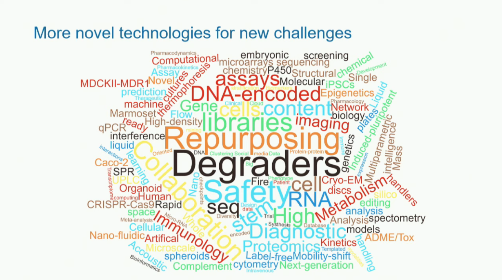

## Therapeutic modalities
* Small molecule
* Antibodies
* Gene therapy
* Cell therapy
* ...more

## Current challenges
* Efficacy, not safety; phase I trials have around 60% success rate.
* We need models that more accurately model a human
* Current models
    * Purified proteins
    * Cell cultures
    * Animal models

## How do we use the Human Genome Project as a roadmap?
* What genes cause the disease?
* What goes wrong in which cells?
* Find the right treatment for the right patient at the right time.

## New technologies
* Human kidney organoids (Dvela-Levitt et al., Cell, 2019) ([ipfs](https://ipfs.io/ipfs/Qmc8Zxpw5KKAXWm39Ta8bw44mwRn24CFmA6RCHsr34d2ED))

